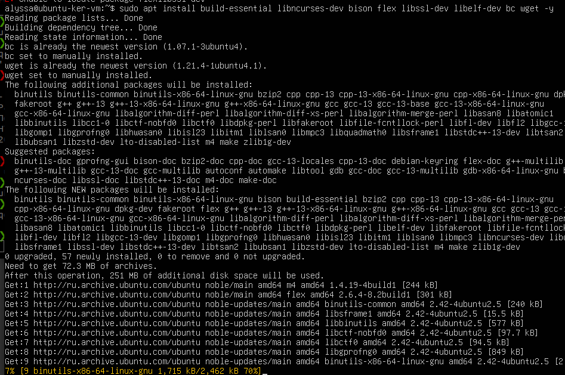
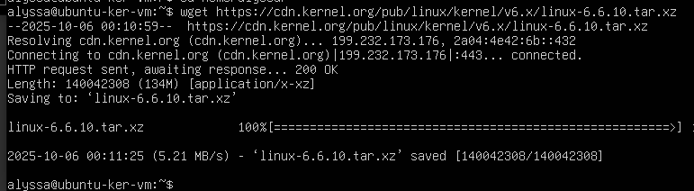
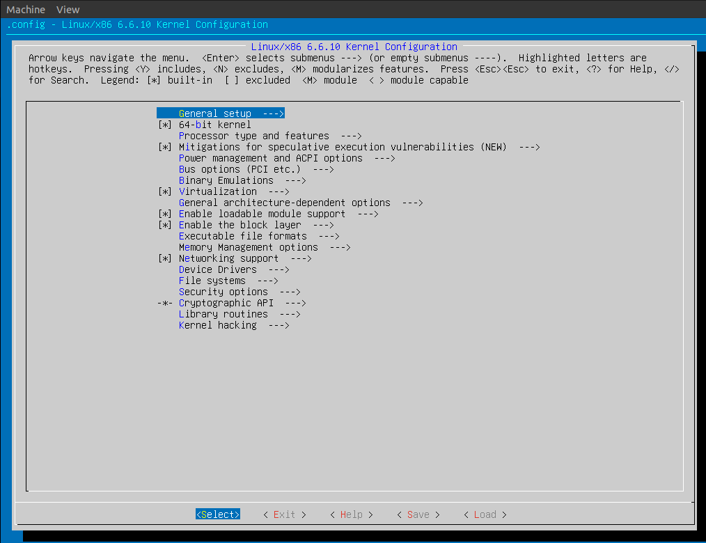

Собрать ядро Linux для x86_64, постараться выключить все лишние опции. Установить и проверить работоспособность. В качестве ответа прислать документ с командами сборки и установки ядра, скриншоты подтверждающие работоспособность системы и запуск ядра.

##  ядро Linux для x86_64

sudo apt update  
sudo apt upgrade -y  

sudo apt install build-essential libncurses-dev bison flex libssl-dev libelf-dev bc wget -y  
вывод:  

cd ~    

wget https://cdn.kernel.org/pub/linux/kernel/v6.x/linux-6.6.10.tar.xz  
вывод:  

tar -xf linux-6.6.10.tar.xz  

заходим в директорию  

make menuconfig 

