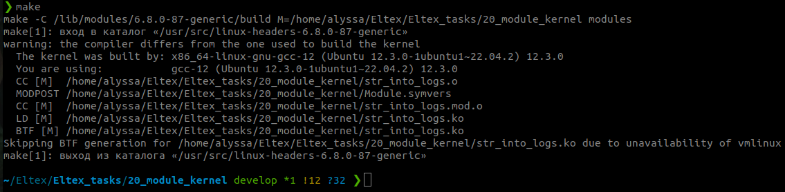
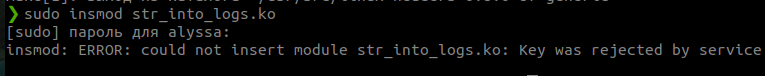
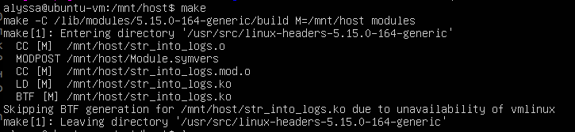
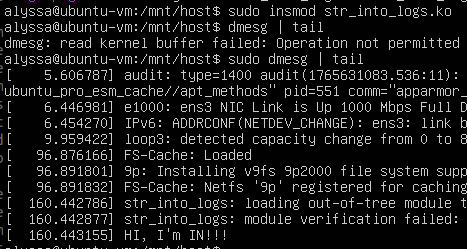
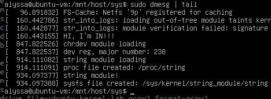
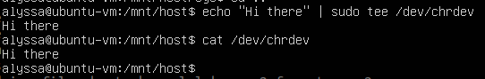
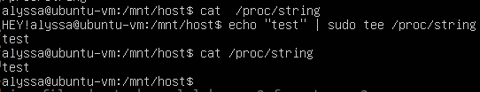
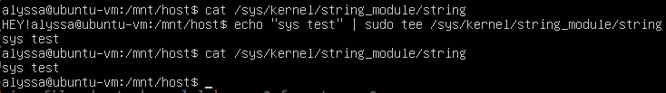
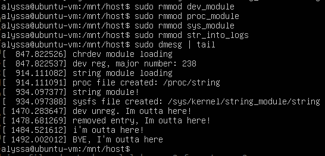

Написала модули ядра, которые взаимодействуют с системой через символьное устройство /dev, файловую систему /proc и файловую систему /sys

во всех реализованы операции чтения и записи

Вывод сборки:  

Загружаем модуль:  
sudo insmod str_into_logs.ko  
  
fine vm it is  
make  
  
sudo insmod str_into_logs.ko  
sudo dmesg | tail  
  
  
собрали и загрузили модули dev,sys,proc  
Логи:  
  

Проверяем chrdev   
  
строка записана и прочтена   
  
проверяем модуль proc  
  

sys  
  
  
Выгрузила модули и проверила логи  
   
