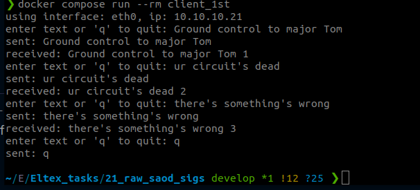
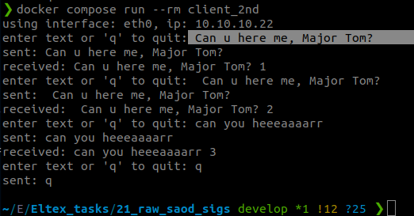

Запуск:  
docker compose build  
docker compose up -d server  
docker ps  - проверяем запущен ли сервер  
docker compose run --rm client_1st  
docker compose run --rm client_2nd  

Результаты работы программы: 

  

