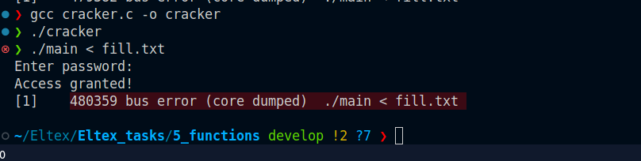

абонентский справочник с использованием функций находится в  папке 4_structures

Последовательность команд:

gcc -fno-stack-protector -no-pie main.c -o main

gcc cracker.c -o cracker

./cracker

./main < fill.txt

Результат:

