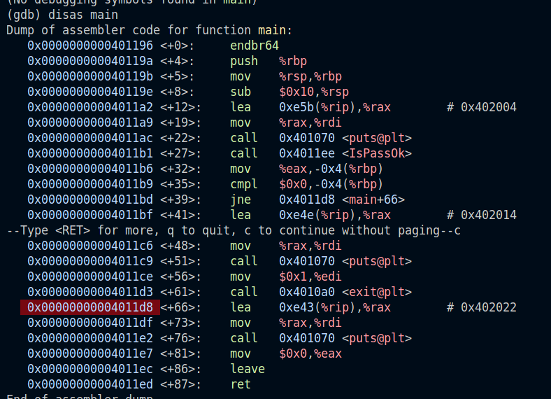
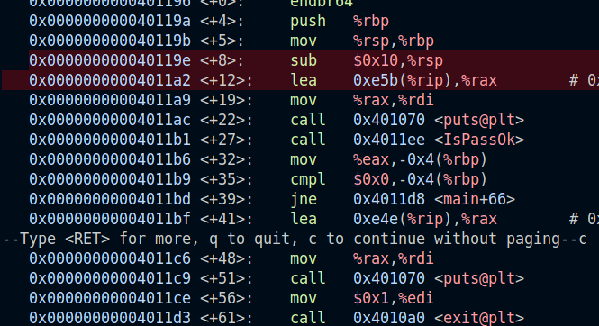
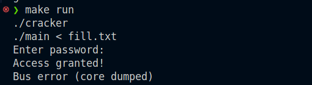

абонентский справочник с использованием функций находится в  папке 4_structures

5.2:

Последовательность команд:

jump not equal указывает на 0x4011d8 (main+66)

+8 - смещение 8 байт от начала main

0x10 = 16 в десятичной 

sub    $0x10,%rsp - вычитает их из регистра rsp, указателя стека (16 байт выделяется под локальные переменные)

12 байт от начала main + 4 для выравнивания

в cracker.c мы переполняем буфер, перезаписывая сохраненный rbp (8 байт) и адрес возврата (+8)

Всего 28 байт.

make rebuild 

make run

Результат:

