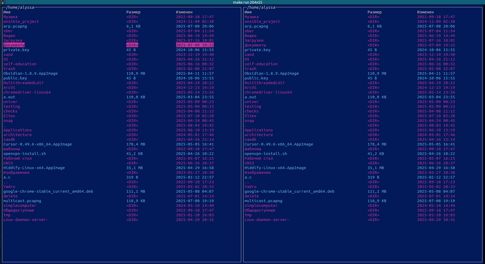

запуск 9.2 - make rebuild, make run

запуск 9.1 - gcc string_from_f_backwards.c -o string_from_f_backwards   

./string_from_f_backwards   

навигация - по стрелкам или с помощью touchpad

выход - q

открыть файл или папку - enter (через xdg-open)

Скриншот работы программы:

